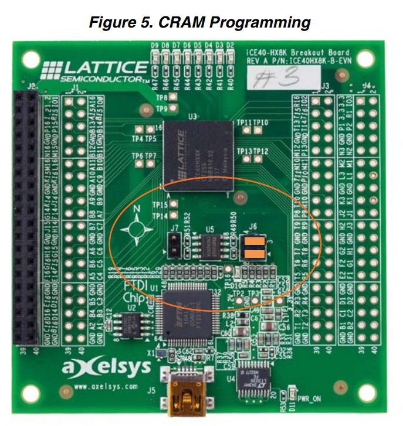

DryGASCON128 on RISC-V / HX8K FPGA

# Overview
This project demonstrate how the verilog implementation can be integrated into a the low cost FPGA board "iCE40-HX8K Breakout Board". It allows to send arbitrary messages to DryGASCON128 core and to read its output. It also allows to run the core on pseudo random data and generate trigger signal for DPA traces gathering with minimal I/O overhead.

All the heavy lifting is done by the Murax project: the core is integrated as an APB3 slave peripheral, the serial communication and the overall protocol is handled by software (C99 code running on Murax's RV32I CPU).

# Dependencies
To merely load the prebuilt image, you need:
* icestorm tools (like icepack and iceprog)

To modify the bitfile:
* Yosys
* arachne-pnr
* sbt

To modify the software:
* riscv toolchain

# Loading the pre-built image:

* Configure the board for CRAM Programming mode (see figure)
* Connect to your computer via USB cable
* Connect a serial terminal program such as [moserial](http://live.gnome.org/moserial). The board shall appear as something like "/dev/ttyUSB1"
* In a shell, go to scripts/Murax/iCE40-hx8k_breakout_board
* type "make prog"

You shall get the following:

    user@lafite:/tmp/diff/r2/drygasconv1_hx8k_fpga/scripts/Murax/iCE40-hx8k_breakout_board$ make prog
    iceprog -S bin/toplevel.bin
    init..
    cdone: high
    reset..
    cdone: low
    programming..
    cdone: high
    Bye.

The serial terminal shall display the following:

    A00000000

    OK
    00000087 00000087
    00000087 00000087
    00000087 00000087

# Regenerating the Murax verilog:

    * In a shell, go to scripts/Murax/iCE40-hx8k_breakout_board
    * type "make"

# Compiling the bitfile:

* In a shell, go to scripts/Murax/iCE40-hx8k_breakout_board
* type "make compile"

# Compiling the software:

* In a shell, go to software/projects/murax
* type "make"

WARNING: to take the changes into account in the FPGA bitfile, you need to regenerate the Murax verilog.

# Serial communication usage
After startup the software is sending its version as a single byte. Then it is checking the consistency between the hardware implementation and a software implementation, if they match, it sends "OK".

Then it does a benchmark of the software implementation and print 3 lines of results.

Finally it enters the interactive loop which gives you control of the hardware implementation. C and X are fixed (hardcoded in the source code), you can control only the input I and the domain separator. The software expect to receive I as 16 bytes and then the domain seperator as a full byte.
